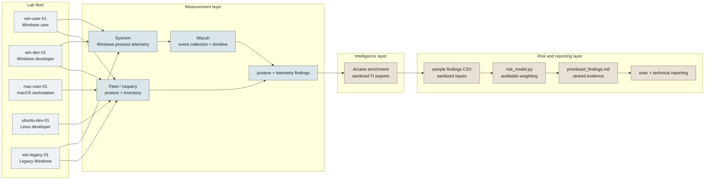

# Architecture

## Why This Stack

Fleet/osquery answers declarative posture questions. I want controls stated as queries and policy results, not as whatever a console happened to display during an audit week.

Sysmon plus Wazuh exists because posture checks cannot see an encoded command line. Fleet can tell me whether a logging control is present; telemetry tells me what actually ran after the endpoint drifted.

The Python model exists because prioritization opinions belong in auditable code, not spreadsheet folklore. The weights are intentionally small enough to argue with: KEV, EPSS, exploit availability, Arcane context, endpoint criticality, exposure, persona risk, legacy uplift, and named compensating-control buy-downs.

Arcane exists because a feed is not a strategy. Enrichment has to be able to change a decision, not annotate it, so source freshness, confidence, actor context, and ATT&CK mapping are inputs to priority instead of side notes.

## Build vs. Buy

At real fleet scale, I would buy the measurement layer. Agents, pipelines, dashboards, and enrollment consoles are commodity engineering, and rebuilding them is an expensive way to get a worse version of something the market already solved. I would build where judgment is encoded: prioritization logic and intelligence integration, because that is where buying is weakest and where the organization's risk posture actually differs from everyone else's.

## Data Flow

osquery results move to the Fleet server, and Sysmon events move through the Windows event log into the Wazuh manager. Findings are exported to CSV for `risk-scoring/risk_model.py`, while Arcane exports are sanitized before they enter this repo. The lab network is isolated, and `mac-user-01` is posture-read-only: enrolled for measurement, excluded from attack and drift scenarios.
