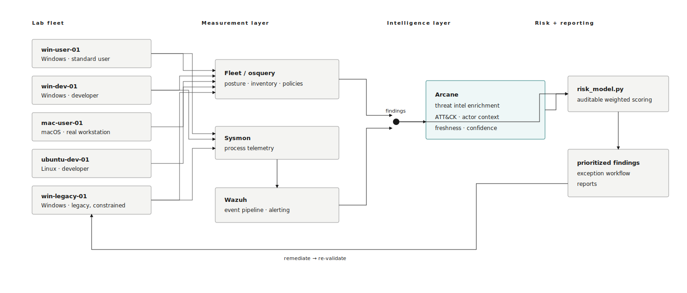
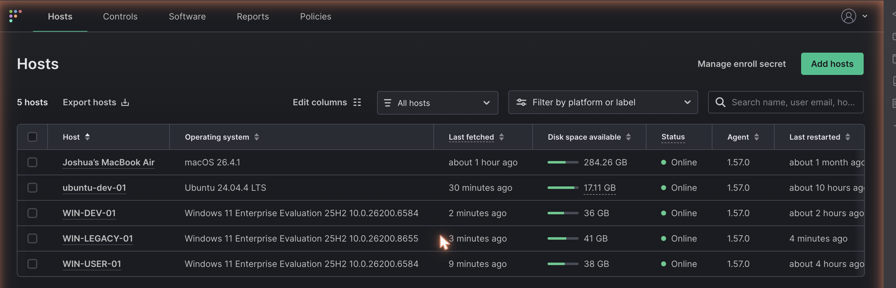
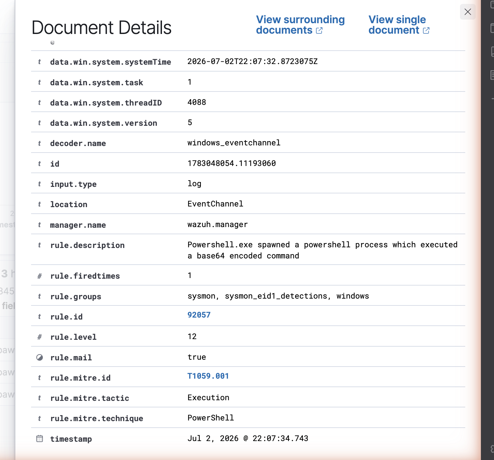

# Threat-Informed Endpoint Security: A Five-Endpoint Control-Plane Case Study

*Fleet/osquery · Wazuh · Sysmon · Python risk scoring · Arcane threat intelligence*

Joshua Geise · josh.t.geise@gmail.com · [github.com/jgeise397/endpoint-security-control-plane-poc](https://github.com/jgeise397/endpoint-security-control-plane-poc)

---

## 1. The problem, from the attacker's side

I've spent eight years in incident response and threat intelligence, which means I've mostly seen endpoint security programs at the moment they failed. Almost none of those failures were exotic. The pattern that actually shows up in casework is drift: the firewall rule somebody relaxed during a troubleshooting call and never restored, the local admin account created for a vendor and forgotten, the legacy box that everyone agreed to deal with next quarter for eleven consecutive quarters. The initial access technique varies; the terrain that let it become an incident rarely does.

So I built the control plane I kept wishing the victims had. Five real endpoints — Windows user and developer machines, a macOS workstation, a Linux developer box, and one deliberately legacy Windows host — with desired state defined as code, actual state measured continuously, drift detected in minutes rather than audits, and remediation prioritized by who is actually exploiting what, not by CVSS score alone.

Two framing commitments up front. First: severity is not priority. A critical CVE nobody is exploiting on an isolated box loses to a medium on an exposed developer workstation with a weaponized exploit in active use, and a scoring model that can't express that is decorating reports, not driving decisions. Second: scope honesty. This is a five-endpoint lab with real machines and real telemetry — a working model of the operating loop behind an enterprise endpoint program, not a claim of enterprise scale. Where the difference matters, I say so explicitly (§7).

## 2. Operating model and architecture

The tools are table stakes; the loop is the product:

**define → measure → detect drift → prioritize (threat intel + business context) → remediate → validate → report**

Everything in the stack exists to serve a step in that loop. Fleet and osquery answer posture and inventory questions — is the control present, on, and configured as declared. Sysmon feeding Wazuh provides the security telemetry depth that posture checks can't: not just "is PowerShell logging configured" but the actual encoded command line when it runs. A small Python risk model holds the prioritization opinions, in code, where they can be audited and argued with. And Arcane — my threat intelligence platform, covered in §4 — supplies the context that turns a ranked vulnerability list into a defensible set of decisions.

I want to be precise about what this is not: I am not replicating Jamf, CrowdStrike, or Tenable on a hypervisor. I'm modeling the operating loop those products serve, at a scale where every moving part stays inspectable. On build-vs-buy: at any real fleet size I would buy the measurement layer without hesitation — agents, data pipelines, and console are commodity — and reserve engineering effort for the layers that encode judgment, which is exactly where this POC spends its depth: the prioritization model and the intelligence enrichment. That's also where buying is weakest.

The fleet:

| Endpoint | OS | Persona | Criticality | Exposure |
|---|---|---|---|---|
| win-user-01 | Windows | Standard user | Medium | Normal |
| win-dev-01 | Windows | Developer | High | Elevated |
| mac-user-01 | macOS | Creative user (real workstation) | Medium | Normal |
| ubuntu-dev-01 | Linux | Developer | High | Elevated |
| win-legacy-01 | Windows | Legacy, business-critical | High | Constrained |

Four are VMs on my own hypervisor; mac-user-01 is my actual daily-driver Mac, enrolled for posture measurement and excluded from every attack scenario — because enrolling a real, messy, in-use machine is a more honest test of the measurement layer than a pristine VM.





## 3. Five scenarios: an arc, not a list

The scenarios were run in a deliberate order — telemetry depth, then drift, then constrained remediation, then cross-platform, then the full prioritization model — under a written, human-approved scope: lab VMs only, reversible actions only, the real Mac excluded from all of it. Between them they exercise the OS, App, and App Configuration levels. All five were detected. Two of them taught me something the policy definitions alone would not have.

**3.1 — Encoded PowerShell (win-user-01).** An `-EncodedCommand` one-liner, the classic first move after initial access. Default logging on an unmanaged box is nearly blind to this; the telemetry layer is not. Sysmon recorded the process creation (Event ID 1) with the full command line, the Wazuh agent forwarded the Sysmon channel, and the manager raised rule 92057 at level 12, mapped to ATT&CK T1059.001 — end to end on the first try:

```
CommandLine: "C:\WINDOWS\System32\WindowsPowerShell\v1.0\powershell.exe"
  -NoProfile -EncodedCommand RwBlAHQALQBEAGEAdABlACAAfAAgAE8AdQB0AC0ARgBpAGwA...
→ Wazuh rule 92057 (level 12): "Powershell.exe spawned a powershell process
  which executed a base64 encoded command" · MITRE T1059.001 · Execution
```

One honest note: the command was launched through the lab's remote-execution harness, so the event's parent process and user context reflect the harness, not an interactive session. The evidence that matters — the encoded command line Sysmon preserved while native logs stayed thin — is unaffected.



**3.2 — Local admin creation (win-dev-01), and the first real gap.** At 02:39:50 UTC I added a local account to Administrators. Two detections were supposed to fire: Windows Security event 4732, and the Fleet policy `Local Administrators group matches baseline`. The 4732 event fired immediately. The Fleet policy did not — it re-evaluated twice with the drift present and returned pass both times, while a standalone osqueryd run on the same host, using the same query, saw the new admin instantly. The policy only flipped to fail at 02:46:43, after the agent's osquery worker recycled. The cause: osquery caches its expensive Windows account enumeration inside the long-running agent process, so a runtime change to group membership isn't reflected until that cache turns over. That's a detection-latency floor the policy definition alone will never show you. The takeaway isn't "the policy is broken" — it's that periodic posture polling and event-driven telemetry are not interchangeable, and a mature detection uses both while knowing which one it's trusting for latency. There's a persona note here too: a new admin on a developer box is plausibly legitimate, so the model raises priority for review rather than auto-remediating — risk-based response, not a mandate.

**3.3 — RDP enabled on the legacy box (win-legacy-01).** Enabled RDP via the registry and firewall group. The Fleet policy flipped to fail roughly fourteen seconds after its next evaluation — a useful contrast, because this check reads the registry, which osquery does not cache the way it caches account enumeration. The scenario-3.2 latency floor is specific to the heavy enumeration tables, not a general property of the stack; confirming that boundary was worth the scenario on its own. What makes this one different is what "remediation" means: Arcane's context for T1021.001 elevates RDP as ransomware's historical front door, but on this box the answer is not a patch ticket — it's the compensating-control set and the documented exception workflow in §5. RDP went back off, and the policy that watches it is itself one of the compensating controls.

**3.4 — Weak SSH configuration (ubuntu-dev-01).** Permitted root login and password auth in `sshd_config`; both Linux policies flipped to fail on the next evaluation and returned to pass after the config was restored. A clean fail-to-pass pair, with one stated scope limit: the checks parse the main config via osquery's augeas table, so a directive in a `sshd_config.d/` drop-in is outside their reach — a production version would resolve the effective config. The same measurement loop ran against the real Mac throughout: FileVault, Gatekeeper, and SIP pass; the application firewall being off is real drift on a real machine. Hardening measured on all three OSes, one of them not a lab artifact.

**3.5 — The same vulnerable app on two personas: the payoff.** I installed 7-Zip 21.07 on both Windows personas. Software inventory caught it on both (win-user-01 immediately; win-dev-01 after the same cache turnover from 3.2 — same latency floor, different table, which is how you find out a quirk is actually a property). The CVE is CVE-2022-29072: CVSS 7.8, which by severity alone says *urgent, both boxes, same rank*. The intelligence says otherwise: EPSS ~1.5%, not in CISA KEV, vendor-disputed, PoC-only — part of scoring "exploit availability" is validating what the publicly disclosed exploit actually requires, and this one needs local access and user interaction and is contested by the vendor. Arcane's verdict: low-signal, 0.20. The model output:

```
F-002  win-dev-01   CVE-2022-29072   37.28   rank 8 of 10
F-001  win-user-01  CVE-2022-29072   30.68   rank 9 of 10
  identical vuln factors (cvss 12.48, epss 0.40, kev 0.00, exploit 7.00, arcane 2.00)
  delta 6.60 = criticality (7.00 vs 4.20) + exposure (4.80 vs 3.00) + persona (3.60 vs 1.60)
```

Same CVE, same intelligence, two different priorities — the delta fully attributable to business context in the factor breakdown — and *both* rank near the bottom of a ten-finding queue despite CVSS 7.8, below two CVSS-10.0 findings at ranks 7 and 10, while the top of the queue belongs to a KEV-listed, weaponized Outlook vulnerability at 94.88. That's severity-is-not-priority demonstrated from real inventory data, not a slide.

## 4. Arcane: the intelligence layer

Most pipelines that call themselves threat-informed bolt a feed onto a scanner and call the join a strategy. I run a production threat intelligence platform — Arcane: 25+ OSINT enrichers behind a three-tier enrichment pipeline, an ATT&CK cultivation engine, multi-source confidence laddering, an explicit source-freshness policy, and an attribution engine — and for this POC I pointed it at my own endpoint findings.

The standard I hold intelligence to is that it must be able to *change* the decision, not annotate it — and in this build it did, in both directions. The scary-looking finding got deprioritized: CVE-2022-29072's CVSS 7.8 reads as a fire, but KEV-false, EPSS at 1.5%, a vendor dispute, and PoC-only exploitation earned it a low-signal verdict that let two real endpoints sit at ranks 8 and 9 while actually-exploited findings held the top of the queue. And the boring-looking finding got elevated: RDP enabled on a legacy box isn't a CVE at all, but T1021.001 context — ransomware's historical front door, on the one host that can't take the modern baseline — produced an *attention* verdict that routes straight into the §5 exception review. Intelligence that only ever says "everything is worse than you thought" is a smoke detector with the battery removed; the deprioritizations are where the credibility lives.

```json
"verdict": "low_signal",  "priority_effect": "deprioritize",
"exploitation": { "cvss_31": 7.8, "kev": false, "epss": 0.0152,
                  "exploit_maturity": "poc", "vendor_disputed": true },
"confidence":  { "score": 0.62 },
"freshness":   { "feed_corpus_last_refreshed": "2026-06-07",
                 "platform_health": "degraded" }
```

Freshness and confidence are first-class fields in that export, not metadata — and this capture demonstrates why in a way I didn't plan. When I generated these frames, Arcane's feed corpus was stale (last refreshed 2026-06-07) because the platform was in a degraded state, and the export *says so* rather than presenting month-old context as current. Stale intelligence is worse than no intelligence: it spends your credibility on last month's picture. A platform that timestamps every source, ladders confidence across corroboration, and flags its own degradation is doing the one thing a threat-informed pipeline owes you — telling you how much to trust it.

One note on the platform's own posture, because tooling that handles threat data is itself an endpoint problem: everything Arcane contributes to this repo is a sanitized export — research egress runs through VPN with a Tor kill-switch, its agents have no direct egress, and no credentials, private indicators, or live-access details leave the platform.

## 5. The legacy endpoint: risk acceptance as a workflow

win-legacy-01 exists in this lab because it exists in every fleet I've ever worked an incident in. Mature endpoint security is not "patch everything immediately" — for some business-critical systems that instruction is a fiction, and programs that pretend otherwise just push the risk into shadow. The mature move is to make the exception a *workflow* with an owner, instead of a shrug with a ticket number.

The exception record for win-legacy-01 is committed in this repo: business owner, technical owner, the specific reason the baseline can't apply, the exact controls affected, four compensating controls each naming how it's verified, a quarterly review date, and a retirement plan with a trigger condition. The compensating controls aren't decorative — they're measured by the same Fleet policies as everything else, and §3.3 is what it looks like when one of them (RDP stays off) drifts: detected in seconds, routed to the exception's owner rather than a generic queue.

Risk translation is part of the workflow, so here is the paragraph the business owner actually gets, written for them: *Your application server can't take current patches, and we're not going to pretend it can. Here's what we've done instead: it can only talk to the two systems it needs, nothing on the internet can reach it, and we watch it more closely than any other machine in the fleet. That reduces the likelihood of compromise substantially, but it doesn't eliminate it — and the residual risk is yours to accept, which is what the signature line is for. We review this together every quarter, and the exception ends when the migration ships or when the compensating controls stop holding, whichever comes first.*

This is "risk-based approaches rather than policy mandates," practiced rather than quoted.

## 6. genAI on the endpoint

Rapid genAI adoption is changing what an endpoint even is. Developer machines now routinely run AI CLI agents, MCP servers, and AI browser extensions — a new software-inventory class with an unusually interesting data-egress profile, since these tools exist specifically to read things and send them somewhere. Most inventory programs haven't caught up: they can tell you Chrome is outdated, but not that an agent with shell access enrolled itself last Tuesday. The enrolled fleet here includes exactly one machine with a real genAI footprint — the actual workstation, which runs the agent CLIs and MCP servers I work with daily — and that footprint is ordinary osquery inventory surface: packages, processes, launch items. It should be inventory, not folklore.

I hold an unusual vantage point on this problem: I operate a production fleet of autonomous AI agents, so I've had to solve their endpoint posture from the operator's chair — least-privilege service users per agent, secrets isolation, restricted SSH for anything that writes, egress-controlled containers for anything that fetches. The controls that transfer to workforce endpoints are the boring ones: inventory the agents like software (because they are), scope their credentials like service accounts (because they are), and gate their writes behind human approval where the blast radius warrants it. Same discipline, new package names.

## 7. At enterprise scale, and what the numbers say

Translating this lab honestly: the Fleet policy pack maps to MDM compliance in Jamf, Kandji, or Intune plus CrowdStrike or Tenable doing detection and vulnerability coverage at scale; the Python risk model is the prioritization logic that lives inside a vulnerability management program, here made small enough to read; the exception record is what an exception *system* — with SLAs, aging metrics, and escalation — manages in the thousands. The lab's job was never to replace those; it was to demonstrate command of the operating loop they implement, on infrastructure where nothing is hidden behind a vendor console.

The numbers, as decision inputs rather than dashboard art:

- **Enrollment:** 5/5 endpoints across 3 OS platforms, one of them a real in-use workstation.
- **Controls:** 26 policies deployed — 10 Windows, 8 macOS, 8 Linux.
- **First-run posture, unremediated:** each Windows host 7/10, Linux 7/8, macOS 4/8 — 32 of 46 host-policy evaluations passing. I left BitLocker and screen-lock failing on the Windows VMs on purpose: nothing pushes configuration to these boxes except the thing measuring them, and a green board I hand-arranged proves nothing.
- **Drift detection:** 5/5 scenarios detected; 2 of them exposed behavior the policy definitions don't describe.
- **Time-to-detect:** Security event 4732, immediate. RDP policy, ~14 seconds after evaluation. Local-admin policy, ~7 minutes — bounded by osquery's account-enumeration cache, documented in §3.2 and confirmed on a second table family in §3.5.
- **Intelligence effect:** context changed the priority decision in both directions on real findings — the CVSS-7.8 pair down to ranks 8 and 9, the CVE-less RDP exposure up into exception review.

What's unfinished, stated plainly: Wazuh's security-configuration-assessment and vulnerability-detection modules aren't deployed to macOS — the agent isn't on the real Mac, so that coverage is in progress, not claimed. The SSH checks don't resolve `sshd_config.d/` drop-ins. The browser-version floor is a pinned constant that would need a version-feed in production. And the osquery caching floor from §3.2 is documented, not fixed — fixing it properly means event-driven coverage for the affected tables, which is the pairing the scenario argued for. The rough edges stay in the document on purpose; a POC with no visible tradeoffs is describing someone else's build.
